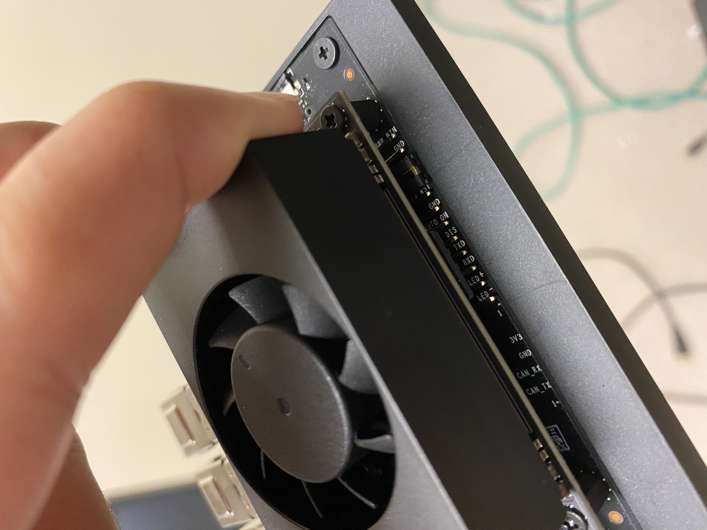
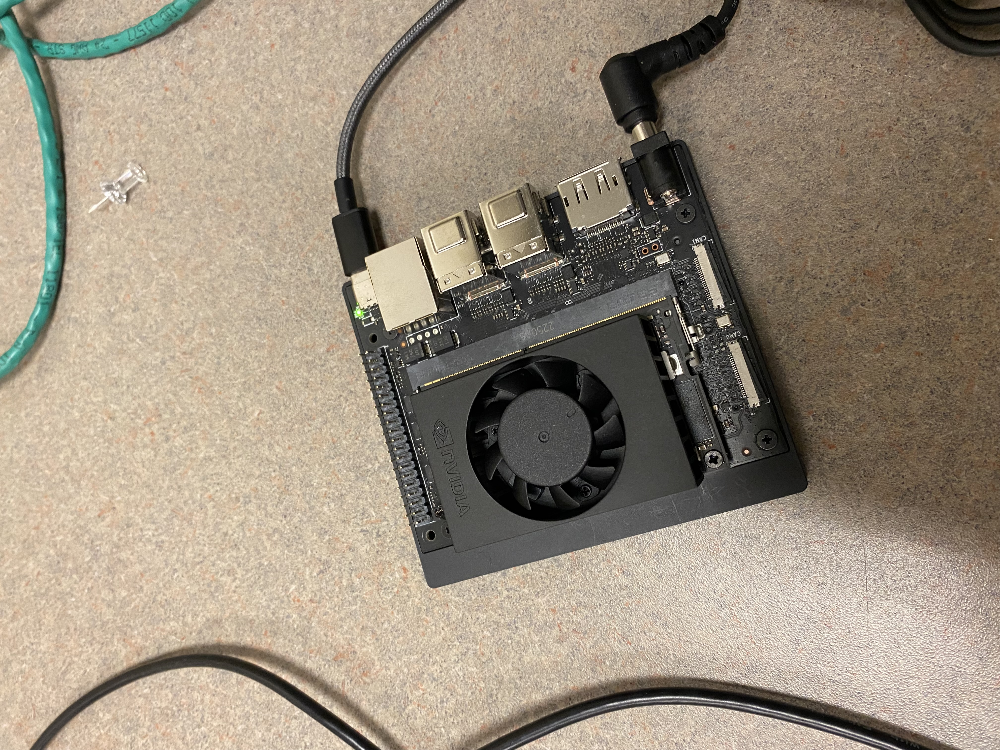
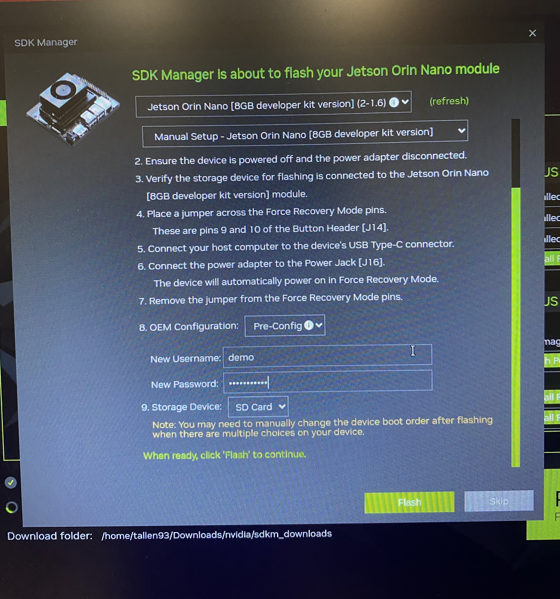

[Nvidia Website Imaging Info](https://developer.nvidia.com/embedded/learn/jetson-orin-nano-devkit-user-guide/software_setup.html)

# Step by Step Guide
 - **Insert the jumper**

   On this Jeton Nano configuration we are attaching the jumper to the third and fourth right most pins. We suggest you consult the pinout guide for your model of device.

   

 - **Plug into computer**

   Plug in USB-C and power. Make sure the light is on but the fan is not running on the Nano.

   

 - **Remove the jumper**

   There is a little hook that you can latch your fingernail into.

 - **Follow software steps**

   Here we are using the Nvidia SDK Manager for Ubuntu. Make sure to check the boxes for developer tools. Make sure to use the [8GB developer kit version].

   

 - **It should... maybe... work!**

   Enjoy your flashed Jetson Nano
